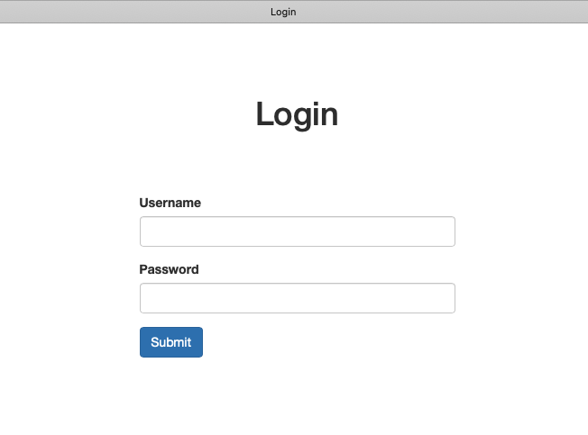
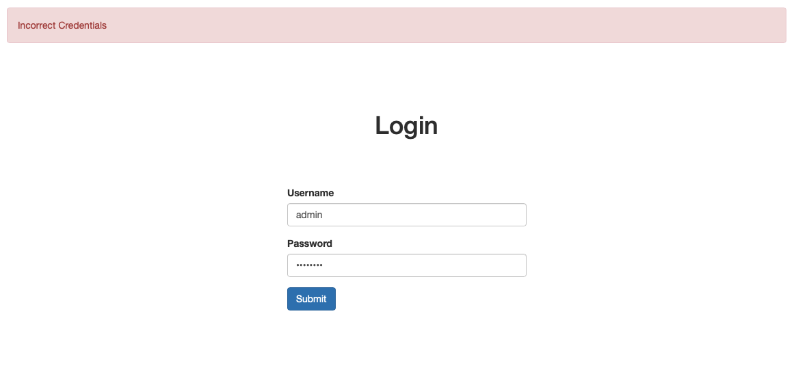
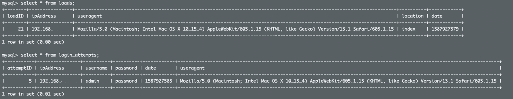
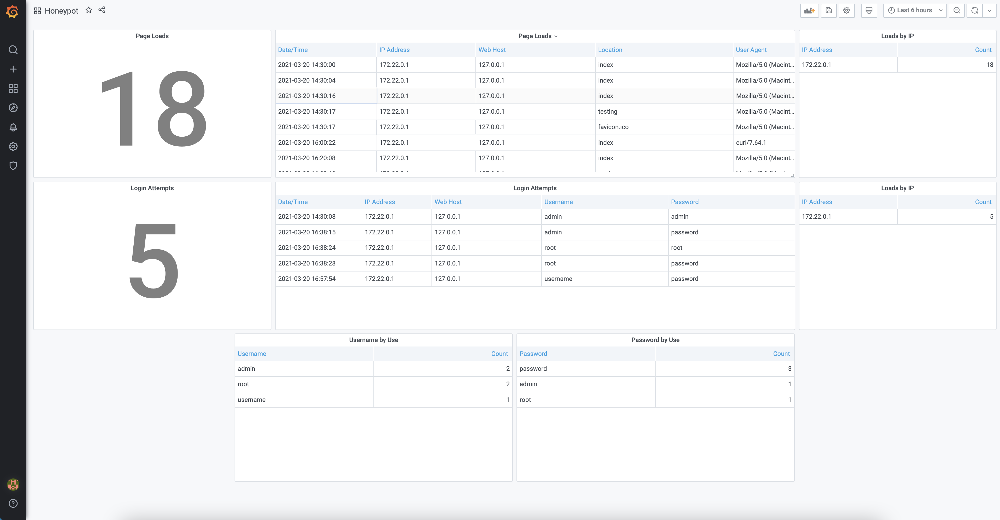

# Background
I had a few ports open to the web at home that connected to a reverse proxy. In terms of security, I had my reverse proxy set up such that if you were scanning subnets and found mine, my proxy forwarded traffic to Google. It got me thinking about how many people were scanning or trying to get into my home network. This application is a simple Flask app that displays a login screen. On load, the App gets the user's IP address, location (url path), and user agent (browser info). When the user pushes a login, Flask captures the above info (minus location) and also username/password. Depeneding on your home network, you could tie in an API such that if an IP address fails 5 times, they are blocked by the firewall. 

# Installation
There are two paths to use this: locally or via Docker. Docker has an issue in that it masquerades IPs coming from the outside. This means that any login attemt will have the Docker IP of your host, which kind of defeats the purpose. That being said, you if you run a reverse proxy in front of the application, you could pass through `x-forwarded-for` (which I do). If this is running open, then the Flask app needs to get `remote_addr` inorder for it to be effective.

### Clone the repo
In either case, you need to clone the repo.
```
git clone https://github.com/rml596/web-honeypot.git
```

## Docker
To run via Docker, make sure Docker and Docker Compose are installed.<br>
Edit the `docker-compose.yml` the variables for `MYSQL_ROOT_PASSWORD` and `web/PORT` as needed. 
<br><br>
You can also remove the `services/database/ports` values if you don't want to expose MySQL (removing this is recommended). <br>
If you have multiple interfaces on your machine (Exp - internal and external), you can set the ports to listen on a specific IP. 
Example
```yml
ports:
      - "10.0.0.1:3000:3000"
```
Once your `docker-compose.yml` is configured, you can start the containers.
```
docker-compose up -d
```

## Local
The directions for running locally will only bring up the honeypot, not the          
Make sure Python3, Pip3 and MySQL are already installed

```bash
pip3 install -r app/requirements.txt
mysql -u < mysql/init.sql
python3 app/app.py
```
# Usage
## Grafana
The Grafana dashboard is running in a container. Normally, the container runs on port 3000. You can access it via [http://host-ip:3000](http://host-ip:3000).

## API
The API runs on [http://host-ip:port/api](http://host-ip:port/api). Swagger Documentation can be viewed at [http://host-ip:port/api/docs](http://host-ip:port/api/docs).

# Screenshots
<br>
Default index
<br>
After a user pushes a login, it displays `Incorrect Credentials`
<br>
Entries in the database, I've censored my IP address.
<br>
Grafana dashboard.

# Future Enhancements
For enhancements open an [issue](https://github.com/rml596/web-honeypot/issues).
